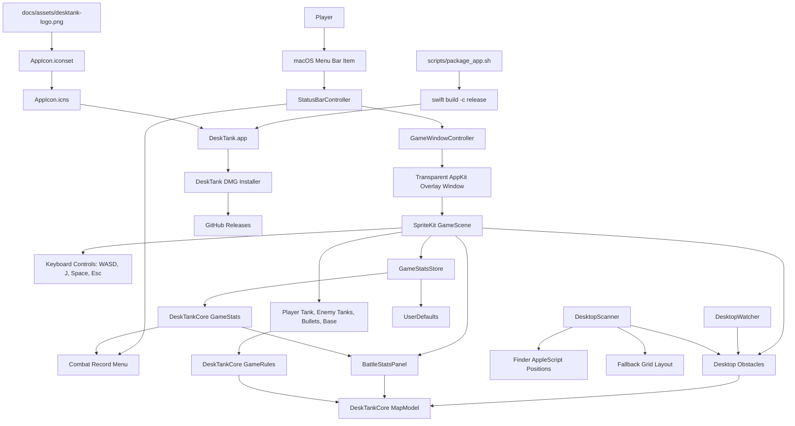

<p align="center">
  
</p>

<h1 align="center">DeskTank</h1>

<p align="center">
  A macOS menu bar tank game that turns your Desktop files and folders into the battlefield.
</p>

<p align="center">
  <a href="README.zh-CN.md">简体中文</a> ·
  <a href="https://github.com/ingeniousfrog/DeskTank/releases">Download DMG</a>
</p>

<p align="center">
  <a href="https://github.com/ingeniousfrog/DeskTank/actions/workflows/ci.yml">
    
  </a>
  
  
  <a href="https://github.com/ingeniousfrog/DeskTank/releases">
    
  </a>
  
</p>

<p align="center">
  
</p>

**Last Updated:** 2026-06-10

## What It Does

DeskTank launches a transparent SpriteKit battlefield over your macOS Desktop.
Desktop files and folders become live obstacles, the battlefield reacts when
you move desktop items, and the game runs from a small menu bar app instead of a
normal window.

The app icon, README logo, and packaged `.app` icon all use the same friendly
blue tank mascot with a red flag.

## Highlights

| Feature | Details |
| --- | --- |
| Desktop battlefield | Files and folders on `~/Desktop` become walls, castles, and collision obstacles. |
| Live map updates | Desktop changes are watched while the game is running. |
| Menu bar app | Start, resume, view records, and quit from the macOS menu bar. |
| Combat record | Tracks kills, current-run kills, wins, losses, and win rate. |
| Real obstacle rules | The combat record panel is part of the map, so tanks and bullets cannot pass through it. |
| DMG packaging | `scripts/package_app.sh` builds a shareable `.dmg` installer. |

## Install

Download the latest `.dmg` installer from
[GitHub Releases](https://github.com/ingeniousfrog/DeskTank/releases). Drag
`DeskTank.app` into Applications, then launch it from the macOS menu bar.

macOS may ask for Finder automation permission so DeskTank can read desktop
icon positions. If permission is denied, the game still runs with a stable
fallback map.

## Controls

| Key | Action |
| --- | --- |
| `W`, `A`, `S`, `D` | Move up, left, down, right |
| `J` | Fire |
| `Space` | Pause or resume |
| `R` | Restart after victory or defeat |
| `Esc` or `Q` | Close the battlefield overlay |
| `Command` + `Option` + `T` | Show or hide the game overlay |

Quitting the app is only done from the menu bar. Closing the battlefield keeps
DeskTank running in the background so the menu action becomes Resume.

## Architecture



## Development

Run locally:

```bash
swift run DeskTank
```

Run tests:

```bash
swift test
```

Build:

```bash
swift build
```

Package a DMG:

```bash
scripts/package_app.sh 0.1.0
```

## Project Layout

| Path | Purpose |
| --- | --- |
| `Sources/DeskTankCore` | Testable game rules, map geometry, collision, movement, and stats models |
| `Sources/DeskTank` | AppKit window, menu bar controller, global hotkey, desktop scanning, SpriteKit scene |
| `Tests/DeskTankCoreTests` | Unit tests for rules, map behavior, and combat stats |
| `docs/assets` | README artwork and the app logo source used during packaging |
| `scripts/package_app.sh` | Release build, app bundle creation, icon generation, signing, and DMG packaging |

## Community

Have ideas about DeskTank, desktop games, or macOS utilities? You can scan the
WeChat Official Account QR code below, follow **观物思理**, and send a private
message there.

<p align="center">
  
</p>
