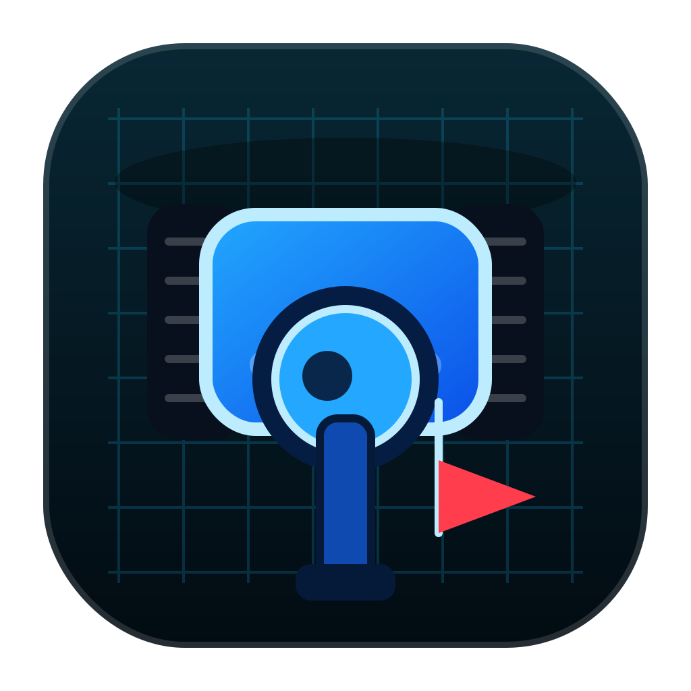
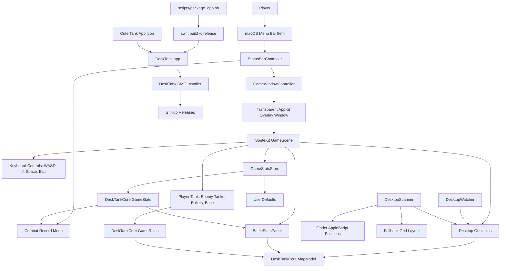

<p align="center">
  
</p>

# DeskTank

DeskTank is a macOS desktop tank-battle prototype. It launches a transparent
SpriteKit battlefield over the desktop, turns Desktop files and folders into
obstacles, and updates the map while the game is running.

<p align="center">
  
</p>

## Install

Download the latest `.dmg` installer from
[GitHub Releases](https://github.com/ingeniousfrog/DeskTank/releases). Drag
`DeskTank.app` into Applications, then launch it from the macOS menu bar.

## Current Gameplay

- `W`, `A`, `S`, `D`: move up, left, down, right
- `J`: fire
- `Space`: pause or resume
- `R`: restart after victory or defeat
- `Esc` or `Q`: close the battlefield overlay
- `Command` + `Option` + `T`: show or hide the game overlay

DeskTank runs as a menu bar app. Click the `DT` item in the macOS menu bar to
see the combat record, start a new game, resume a hidden game, or quit the app.
Quitting the app is only done from the menu bar.

The in-game HUD shows the current state, remaining enemies, base health, color
legend, and controls. The player tank is blue, enemy tanks are red, and the base
is yellow. It also includes a persistent combat record with total kills, current
run kills, wins, losses, and win rate. The HUD is part of the battlefield: tanks
and bullets cannot pass through it.

The app starts the overlay immediately when launched. Desktop files and folders
are scanned as obstacles. DeskTank first tries to read real Finder desktop icon
positions with AppleScript; if macOS denies automation access or Finder does not
return positions, it falls back to a stable right-to-left grid layout.

Desktop folders render as castle obstacles, while desktop files render as wall
segments.

## Architecture



## Run

```bash
swift run DeskTank
```

macOS may ask for Finder automation permission so DeskTank can read desktop icon
positions. If permission is denied, the game still runs with the fallback map.

## Test

```bash
swift test
```

## Build

```bash
swift build
```

## Distribution

For development, run with SwiftPM. For sharing with other Mac users, package a
signed `.app` bundle and distribute that app inside a `.dmg` installer image.
The `.app` is the actual application; the `.dmg` is the convenient delivery
container.

```bash
scripts/package_app.sh 0.1.0
```

## Project Layout

- `Sources/DeskTankCore`: testable game rules, map geometry, collision, movement
- `Sources/DeskTank`: AppKit window, global hotkey, desktop scanning, SpriteKit scene
- `Tests/DeskTankCoreTests`: unit tests for map and rules behavior
