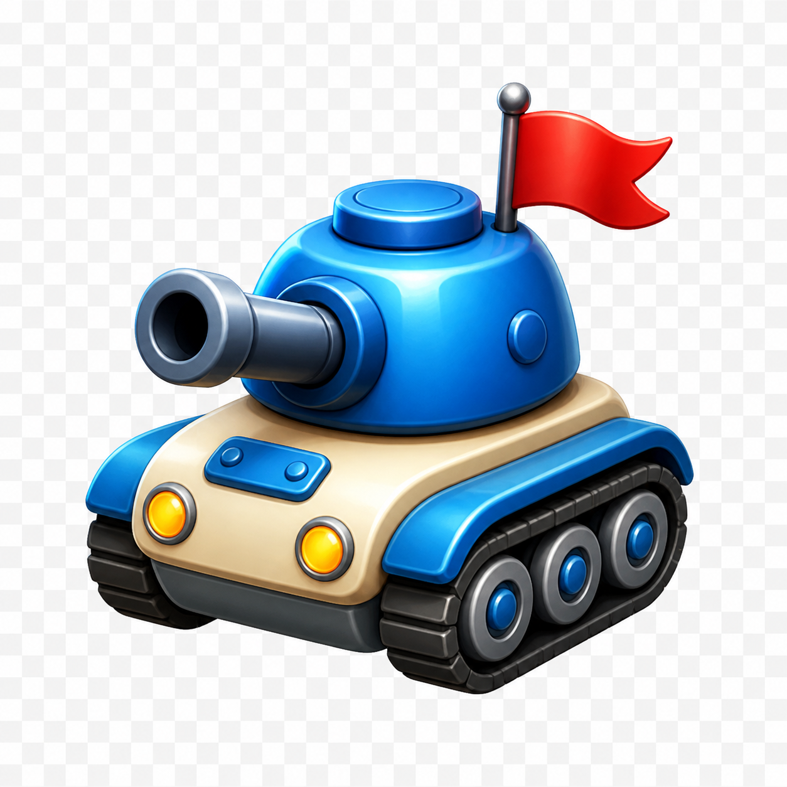
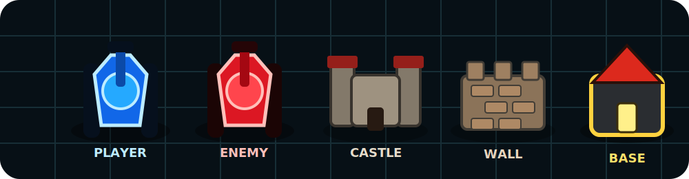
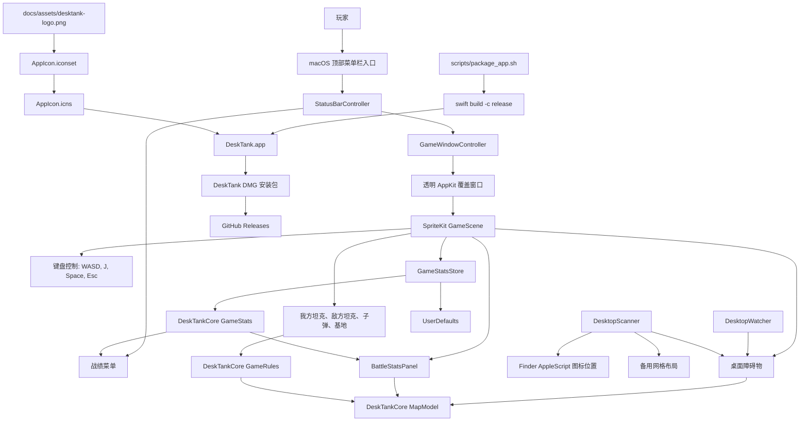

<p align="center">
  
</p>

<h1 align="center">DeskTank</h1>

<p align="center">
  一个 macOS 顶部菜单栏坦克游戏：把你的桌面文件和文件夹变成战场。
</p>

<p align="center">
  <a href="README.md">English</a> ·
  <a href="https://github.com/ingeniousfrog/DeskTank/releases">下载 DMG 安装包</a>
</p>

<p align="center">
  <a href="https://github.com/ingeniousfrog/DeskTank/actions/workflows/ci.yml">
    
  </a>
  
  
  <a href="https://github.com/ingeniousfrog/DeskTank/releases">
    
  </a>
  
</p>

<p align="center">
  
</p>

**最后更新：** 2026-06-10

## 它是什么

DeskTank 会在 macOS 桌面上方启动一层透明的 SpriteKit 战场。桌面上的
文件和文件夹会变成实时障碍物；当你移动桌面图标时，地图也会跟着变化。
整个 app 运行在顶部菜单栏里，不会像普通窗口一样占住桌面。

README 顶部 logo、打包生成的 `.app` 图标，以及 app 内使用的图标都来自
同一张蓝色萌版坦克素材。

## 亮点

| 功能 | 说明 |
| --- | --- |
| 桌面即战场 | `~/Desktop` 上的文件和文件夹会变成城墙、城堡和碰撞障碍物。 |
| 地图实时更新 | 游戏运行时会监听桌面变化，移动文件后地图会随之改变。 |
| 顶部菜单栏 app | 可以从菜单栏开始游戏、继续游戏、查看战绩和真正退出。 |
| 战绩面板 | 记录总击杀数、本局击杀数、胜利数、失败数和胜率。 |
| 真实碰撞规则 | 战绩面板也是地图障碍物，坦克和子弹不能穿过去。 |
| DMG 安装包 | 使用 `scripts/package_app.sh` 生成可分享的 `.dmg` 安装文件。 |

## 安装

从 [GitHub Releases](https://github.com/ingeniousfrog/DeskTank/releases)
下载最新 `.dmg` 安装包，把 `DeskTank.app` 拖进 Applications，然后从
macOS 顶部菜单栏启动。

macOS 可能会请求 Finder 自动化权限，因为 DeskTank 需要读取桌面图标位置。
如果拒绝授权，游戏仍然可以运行，只是会使用稳定的备用地图布局。

## 操作方式

| 按键 | 功能 |
| --- | --- |
| `W`, `A`, `S`, `D` | 上、左、下、右移动 |
| `J` | 开火 |
| `Space` | 暂停或继续 |
| `R` | 胜利或失败后重新开始 |
| `Esc` 或 `Q` | 关闭战场界面 |
| `Command` + `Option` + `T` | 显示或隐藏战场界面 |

真正退出 app 需要从顶部菜单栏点击 Quit。关闭战场界面后，DeskTank 仍会在
后台运行，菜单里的 Start 按钮会变成 Resume。

## 产品架构



## 开发

本地运行：

```bash
swift run DeskTank
```

运行测试：

```bash
swift test
```

构建：

```bash
swift build
```

打包 DMG：

```bash
scripts/package_app.sh 0.1.0
```

## 项目结构

| 路径 | 作用 |
| --- | --- |
| `Sources/DeskTankCore` | 可测试的游戏规则、地图几何、碰撞、移动和战绩模型 |
| `Sources/DeskTank` | AppKit 窗口、菜单栏控制、全局快捷键、桌面扫描和 SpriteKit 战场 |
| `Tests/DeskTankCoreTests` | 游戏规则、地图行为和战绩统计的单元测试 |
| `docs/assets` | README 素材，以及打包时使用的 app logo 源图 |
| `scripts/package_app.sh` | Release 构建、app bundle、图标生成、签名和 DMG 打包 |
